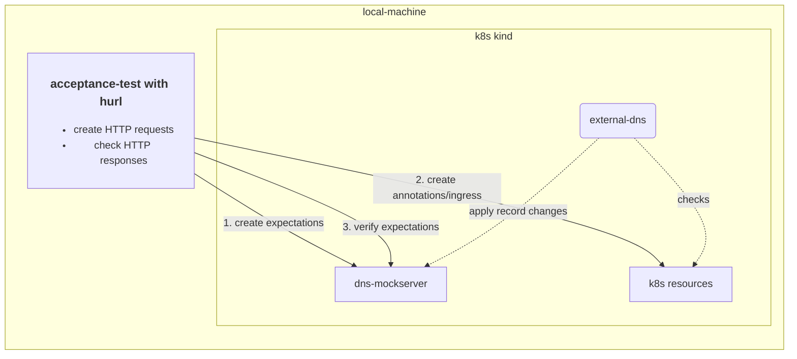

# ExternalDNS - IONOS Webhook

ExternalDNS is a Kubernetes add-on for automatically managing
Domain Name System (DNS) records for Kubernetes services by using different DNS providers.
By default, Kubernetes manages DNS records internally,
but ExternalDNS takes this functionality a step further by delegating the management of DNS records to an external DNS
provider such as IONOS.
Therefore, the IONOS webhook allows to manage your
IONOS domains inside your kubernetes cluster with [ExternalDNS](https://github.com/kubernetes-sigs/external-dns). 

To use ExternalDNS with IONOS, you need your IONOS API key or token of the account managing
your domains. For detailed technical instructions on how the IONOS webhook is deployed using [ExternalDNS for Kubernetes](https://kubernetes-sigs.github.io/external-dns/) helm repo, see [deployment instructions](#kubernetes-deployment).

## Kubernetes Deployment

The IONOS webhook is provided as a regular Open Container Initiative (OCI) image released in
the [GitHub container registry](https://github.com/ionos-cloud/external-dns-ionos-webhook/pkgs/container/external-dns-ionos-webhook).
The deployment can be performed in every way Kubernetes supports.
The following example shows the deployment as
a [sidecar container](https://kubernetes.io/docs/concepts/workloads/pods/#workload-resources-for-managing-pods) in the
ExternalDNS pod
using the [charts for ExternalDNS](https://github.com/kubernetes-sigs/external-dns/tree/master/charts/external-dns).

```shell
helm repo add external-dns https://kubernetes-sigs.github.io/external-dns/

kubectl create secret generic ionos-credentials --from-literal=api-key='<EXAMPLE_PLEASE_REPLACE>'

# create the helm values file
cat <<EOF > external-dns-ionos-values.yaml
image:
  tag: v0.15.1

# -- ExternalDNS Log level.
logLevel: debug # reduce in production

# -- if true, ExternalDNS will run in a namespaced scope (Role and Rolebinding will be namespaced too).
namespaced: false

# -- Kubernetes resources to monitor for DNS entries.
sources:
  - ingress
  - service
  - crd

provider:
  name: webhook
  webhook:
    image:
      repository: ghcr.io/ionos-cloud/external-dns-ionos-webhook
      tag: v0.8.0
      pullPolicy: IfNotPresent
    env:
    - name: LOG_LEVEL
      value: debug # reduce in production
    - name: IONOS_API_KEY
      valueFrom:
        secretKeyRef:
          name: ionos-credentials
          key: api-key
    # The webhook server listens on localhost by default. Otherwise, you can set SERVER_HOST.
    - name: SERVER_PORT
      value: "8888" # default and recommended port for exposing webhook provider EPs
    # The exposed server listens on all interfaces (0.0.0.0) by default. Otherwise, you can set METRICS_HOST.
    - name: METRICS_PORT
      value: "8080" # default and recommended port for exposing metrics and health EPs
    - name: IONOS_DEBUG
      value: "false" # change to "true" if you want see details of the http requests
    - name: DRY_RUN
      value: "true" # set to "false" when you want to allow making changes to your DNS resources
EOF

# install external-dns with helm
helm upgrade external-dns-ionos external-dns/external-dns --version 1.15.1 -f external-dns-ionos-values.yaml --install
```

### namespaced mode

Currently, the rbac created for a namespaced deployment is not sufficient for the ExternalDNS to work.
In order to get ExternalDNS running in a namespaced mode, you need to create the necessary cluster-role-(binding) resources manually:

```shell
# don't forget to adjust the namespace for the service account in the rbac-for-namespaced.yaml file, if you are using a different namespace than 'default'
kubectl apply -f deployments/rbac-for-namespaced.yaml
```

In the helm chart configuration you then can skip the rbac configuration, so in the helm values file you set:

```yaml
namespaced: true

rbac:
  create: false
```

See [here](./cmd/webhook/init/configuration/configuration.go) for all available configuration options of the IONOS webhook.

## Verify the image resource integrity

All official webhooks provided by IONOS are signed using [Cosign](https://docs.sigstore.dev/cosign/overview/).
The Cosign public key can be found in the [cosign.pub](./cosign.pub) file.

Note: Due to the early development stage of the webhook, the image is not yet signed
by [sigstores transparency log](https://github.com/sigstore/rekor).

```shell
export RELEASE_VERSION=latest
cosign verify --insecure-ignore-tlog --key cosign.pub ghcr.io/ionos-cloud/external-dns-ionos-webhook:$RELEASE_VERSION
```

### Metrics

The Go runtime metrics are exposed via the `/metrics` endpoint, and the health check is available on the `/healthz` endpoint. Both endpoints are served on port 8080 by default.

## Development

The basic development tasks are provided by make. Run `make help` to see the available targets.

### Local deployment

The webhook can be deployed locally with a kind cluster. As a prerequisite, you need to install:

- [Docker](https://docs.docker.com/get-docker/),
- [Helm](https://helm.sh/ ) with the repos:

 ```shell
  helm repo add bitnami https://charts.bitnami.com/bitnami
  helm repo add mockserver https://www.mock-server.com
  helm repo update
  ```

- [kind](https://kind.sigs.k8s.io/docs/user/quick-start/)
- [kubectl](https://kubernetes.io/docs/tasks/tools/)

```shell
# setup the kind cluster and deploy external-dns with ionos webhook and a dns mockserver
./scripts/deploy_on_kind.sh

# check if the webhook is running
kubectl get pods -l app.kubernetes.io/name=external-dns -o wide

# trigger a DNS change e.g. with annotating the ingress controller service
kubectl -n ingress-nginx annotate service  ingress-nginx-controller "external-dns.alpha.kubernetes.io/internal-hostname=nginx.internal.example.org." 
 
# cleanup
./scripts/deploy_on_kind.sh clean
```

### Local acceptance tests

The acceptance tests are run against a kind cluster with ExternalDNS and the webhook deployed.
The DNS mock server is used to verify the DNS changes. The following diagram shows the test setup:



For running the acceptance tests locally you need to install [hurl](https://hurl.dev/).
To check the test run execution, see the [Hurl files](./test/hurl).
To view the test reports, see the `./build/reports/hurl` directory.

```shell
scripts/acceptance-tests.sh 
```

