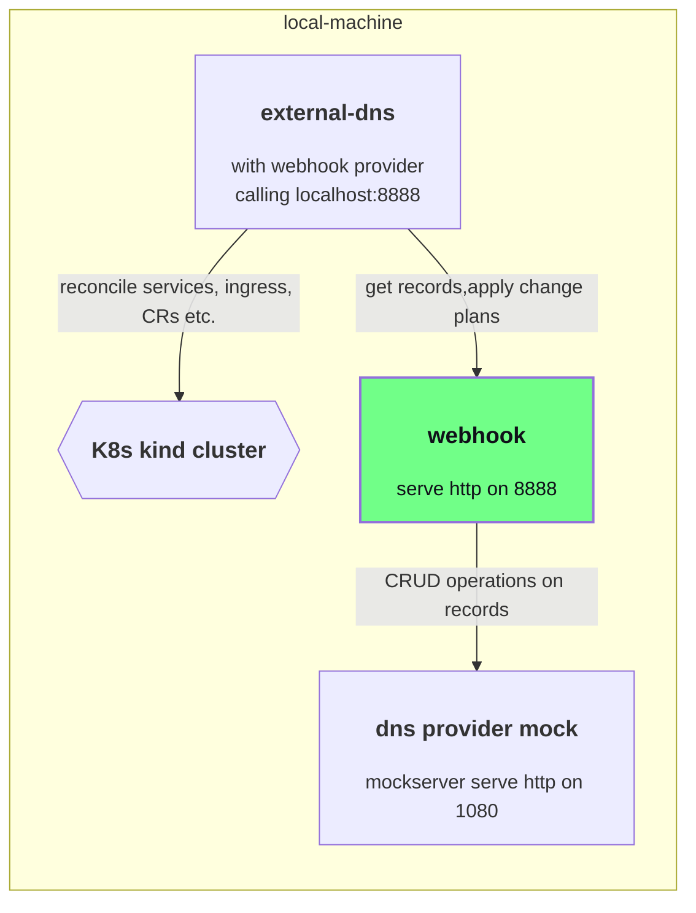

# ExternalDNS - IONOS Webhook

ExternalDNS is a Kubernetes add-on for automatically managing
Domain Name System (DNS) records for Kubernetes services by using different DNS providers.
By default, Kubernetes manages DNS records internally,
but ExternalDNS takes this functionality a step further by delegating the management of DNS records to an external DNS
provider such as IONOS.
Therefore, the IONOS webhook allows to manage your
IONOS domains inside your kubernetes cluster with [ExternalDNS](https://github.com/kubernetes-sigs/external-dns). 

To use ExternalDNS with IONOS, you need your IONOS API key or token of the account managing
your domains.
For detailed technical instructions on how the IONOS webhook is deployed using the Bitnami Helm charts for ExternalDNS,
see [deployment instructions](#kubernetes-deployment).

## Kubernetes Deployment

The IONOS webhook is provided as a regular Open Container Initiative (OCI) image released in
the [GitHub container registry](https://github.com/ionos-cloud/external-dns-ionos-webhook/pkgs/container/external-dns-ionos-webhook).
The deployment can be performed in every way Kubernetes supports.
The following example shows the deployment as
a [sidecar container](https://kubernetes.io/docs/concepts/workloads/pods/#workload-resources-for-managing-pods) in the
ExternalDNS pod
using the [charts for ExternalDNS](https://github.com/kubernetes-sigs/external-dns/tree/master/charts/external-dns).

```shell
helm repo add external-dns https://kubernetes-sigs.github.io/external-dns/

kubectl create secret generic ionos-credentials --from-literal=api-key='<EXAMPLE_PLEASE_REPLACE>'

# create the helm values file
cat <<EOF > external-dns-ionos-values.yaml
image:
  tag: v0.15.0

# -- ExternalDNS Log level.
logLevel: debug # reduce in production

# -- if true, _ExternalDNS_ will run in a namespaced scope (Role and Rolebinding will be namespaced too).
namespaced: false

# -- _Kubernetes_ resources to monitor for DNS entries.
sources:
  - ingress
  - service
  - crd

extraArgs:
  ## must override the default value with port 8888 with port 8080 because this is hard-coded in the helm chart
  - --webhook-provider-url=http://localhost:8080

provider:
  name: webhook
  webhook:
    image:
      repository: ghcr.io/ionos-cloud/external-dns-ionos-webhook
      tag: v0.6.1
    env:
    - name: LOG_LEVEL
      value: debug # reduce in production
    - name: IONOS_API_KEY
      valueFrom:
        secretKeyRef:
          name: ionos-credentials
          key: api-key
    - name: SERVER_HOST
      value: "0.0.0.0"
    - name: SERVER_PORT
      value: "8080"
    - name: IONOS_DEBUG
      value: "false" # put this to true if you want see details of the http requests
    - name: DRY_RUN
      value: "true" # set to false to apply changes
    livenessProbe:
      httpGet:
        path: /health
    readinessProbe:
      httpGet:
        path: /health
EOF

# install external-dns with helm
helm upgrade external-dns-ionos external-dns/external-dns --version 1.15.0 -f external-dns-ionos-values.yaml --install
```

### namespaced mode

Currently, the rbac created for a namespaced deployment is not sufficient for the ExternalDNS to work.
In order to get ExternalDNS running in a namespaced mode, you need to create the necessary cluster-role-(binding) resources manually:

```shell
# don't forget to adjust the namespace for the service account in the rbac-for-namespaced.yaml file, if you are using a different namespace than 'default'
kubectl apply -f deployments/rbac-for-namespaced.yaml
```

In the helm chart configuration you then can skip the rbac configuration, so in the helm values file you set:

```yaml
namespaced: true

rbac:
  create: false
```


See [here](./cmd/webhook/init/configuration/configuration.go) for all available configuration options of the ionos webhook.

## Verify the image resource integrity

All official webhooks provided by IONOS are signed using [Cosign](https://docs.sigstore.dev/cosign/overview/).
The Cosign public key can be found in the [cosign.pub](./cosign.pub) file.

Note: Due to the early development stage of the webhook, the image is not yet signed
by [sigstores transparency log](https://github.com/sigstore/rekor).

```shell
export RELEASE_VERSION=latest
cosign verify --insecure-ignore-tlog --key cosign.pub ghcr.io/ionos-cloud/external-dns-ionos-webhook:$RELEASE_VERSION
```

## Development

The basic development tasks are provided by make. Run `make help` to see the available targets.

### Local deployment

The webhook is deployed with external-dns operating on a kind cluster and a [mockserver](https://www.mock-server.com/) as dns-provider.



As a prerequisite, you need to install:

- [Docker](https://docs.docker.com/get-docker/) and
- [kind](https://kind.sigs.k8s.io/docs/user/quick-start/),


```shell
# setup the kind cluster
make kind

# run the webhook locally  together with external-dns and with mockserver as dns provider
make run-ionos-cloud-webhook

# check the requests to the dns provider mockserver with the mockserver-dashboard
make mockserver-dashboard

# cleanup
make clean
```

### integration tests

Basically the same setup as for the local deployment is used for the integration tests.
However, the according processes external-dns, and mockserver are started from the test code,
only the kind cluster is needed as a prerequisite.
To be safe regarding side effects, you can run `make clean` and `make kind` before you start the tests with `make integration-tests`.


